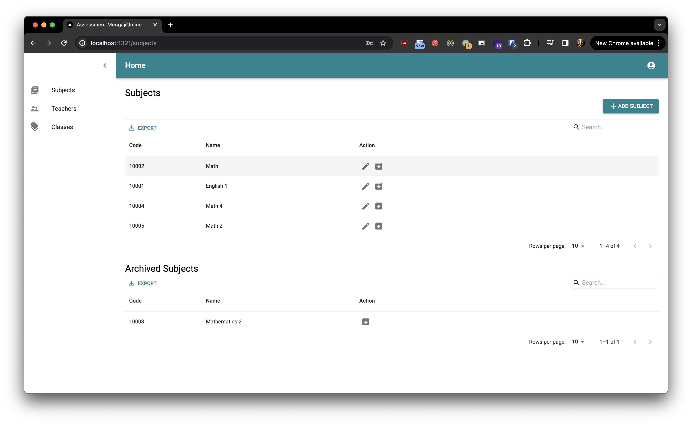
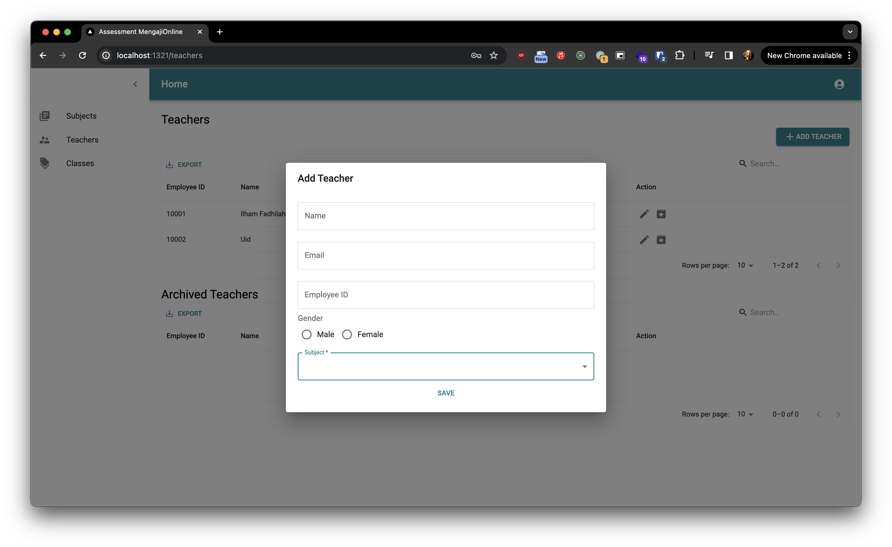

# Coding Assessment

This project using NextJS built using monorepo architecture. I use DDD (domain driven design) for software design. The project is divided to several layer.

- Presentation layer will handle the user interface: `app` folder
- Application layer will handle the REST requests and response: `src/pages/api` folder
- Domain layer will handle the application logic: `src/domains` folder
- Infrastructure layer will handle the connection to external services: `src/infrastructure` folder

## Prerequisite

1. Docker
2. NodeJS Min Version 18

## Running Application In Dev Mode

1. run the docker services for backend

   ```
   yarn docker-compose up -d
   ```

   Make sure all service has running


2. start the application

   ```
   yarn dev
   ```

3. Run database migration

   ```
   yarn typeorm:run
   ```

4. Run database seed for initialize application data

   ```
   yarn db:seed
   ```

5. Open the application on http://localhost:1321

## Running App In Production Mode

1. Build application

   ```
   yarn build
   ```

2. Run database migration

   ```
   yarn typeorm:run
   ```

3. Run database seed for initialize application data

   ```
   yarn db:seed
   ```

4. Start application in production mode

   ```
   yarn start
   ```

5. Open the application on http://localhost:1321

## Build Docker Image

1. change directory to ./misc/docker

   ```
   cd misc/docker
   ```

2. build using `docker compose` command

   ```
   docker compose -f docker-compose.production.yml build app
   ```

## Run Production Mode using Docker

1. change directory to ./misc/docker

   ```
   cd misc/docker
   ```

2. copy .env file for docker compose

   ```
   cp ../../.env .env
   ```

3. run application using `docker compose` command

   ```
   docker compose -f docker-compose.production.yml up -d
   ```

## Backend Guide

### Tech Stack

- Database: PostrgreSQL
- ORM: TypeORM

### Create Migration File

1. Add entity inside `src/infrastructure/database` folder
2. Add the entity to `src/infrastructure/database/provider/typeorm.config.ts` file
3. Run `NAME=<name of the migration> yarn typeorm:generate`. The generated migration file will be inside of `src/infrastructure/database/provider/migrations` folder.
4. RUN `yarn typeorm:run`

## Default User Auth

### Admin

```
email: admin@test.net
password: admin
```

## Deployed Application

You can review the deployed version application on: https://mengaji-online-assessment.vercel.app

# Screenshots








